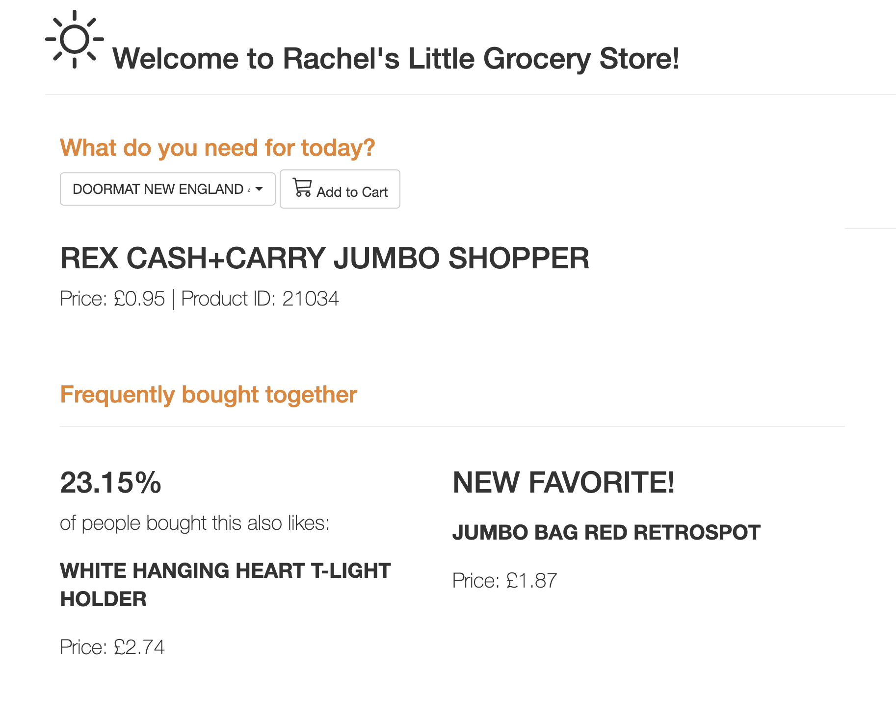

# Product Recommendation - Project Repository
  

<!-- toc -->
#### Developer: Luping(Rachel) Zhao
#### QA: Siqi Li

<!-- toc -->

- [Directory Structure](#directory-structure)
- [Clone the Repository](#Clone-the-Repository)
- [Build the Data Pipeline](#Model-pipeline)
    - [Step 1: Build docker image](#Step-1:-Build-docker-image)
    - [Step 2: Execute the Model Pipeline](#Step-2:-Execute-the-Model-Pipeline)
        - [Execute specific step of the model pipeline](#Execute-specific-step-of-the-model-pipeline)
        - [Clean outputs](#Clean-all-output-files-generated-by-the-model-pipeline)
- [Testing](#Testing)
    - [Reproducibility tests](#Reproducibility-tests)
    - [Unit tests](#Unit-tests)
- [Create Date Base](#Create-database-and-store-the-recommendations )
- [Run webapp](#Run-webapp`Rechel’s Product Recommender for Online Grocery`)
    - [Step 1: Build docker image](#Step-1:-Build-docker-image-for-the-app)
    - [Step 2: Run the app](#Step-2:-Run-the-app)


- [Project Charter](#Project-Charter)
- [Backlog](#Backlog)

<!-- tocstop -->
## Directory structure 

```
├── README.md                         <- You are here
├── app
│   ├── static/                       <- CSS, JS files that remain static
│   ├── templates/                    <- HTML (or other code) that is templated and changes based on a set of inputs
│   ├── Dockerfile                    <- Dockerfile for building image to run app  
│
├── config                            <- Directory for configuration files 
│   ├── local/                        <- Directory for keeping environment variables and other local configurations that *do not sync** to Github 
│   ├── config.yaml                   <- Configurations of model pipeline
│   ├── reproducibility_test.yaml     <- Configurations of reproducibility test
│   ├── test_units.yaml               <- Configurations of unit tests
│   ├── config.py                     <- Configurations of the default value of arguments
│   ├── flackconfig.py                <- Configurations for Flask API
│
├── data                              <- Folder that contains data used or generated.
│
├── deliverables/                     <- Slides and demo pictures of the app
│
├── models/                           <- Trained model objects (TMOs), model predictions, and/or model summaries
│
├── src/                              <- Source data for the project 
│
├── test/                             <- Files necessary for running model tests (see documentation below) 
│
├── app.py                            <- Flask wrapper for running the app 
├── run.py                            <- Simplifies the execution of one or more of the src scripts  
├── requirements.txt                  <- Python package dependencies 
├── Dockerfile                        <- Dockerfile to build docker image for model pipeline
├── Makefile                          <- Make file of model pipeline
├── .gitignore                        <- .gitignore file
```

## Clone the Repository

```bash
# The repository will be download to your current working directory. 
git clone git@github.com:rachelzhaolp/2020-msia423-Zhao-Luping.git
# change working directory to the repository
cd 2020-msia423-Zhao-Luping
```

## Model pipeline 

###Step 1: Build docker image
This command builds a docker image named `prod_rec` with the Dockerfile in your current working directory.
 ```bash
docker build -f Dockerfile -t prod_rec .
 ```

### Step 2: Execute the Model Pipeline
The pipeline uses market basket analysis to make two recommendations for each product. It comprises seven dependent modules:
`acquire`, `clean_data`, `create_basket`, `product_dim`, `split`, `train` and `evaluate`.
* `acquire`: acquire raw data from S3 bucket `msia423-product-recommendation`;
* `clean_data`: remove invalid records and ensure data consistency;
* `create_basket`: reformat the cleaned data to create basket records:(`Row index: order id`; `Column names: product id`; `Values: Binary`);
* `product_dim`: create object table for products:(`Primary Key: product id`)
* `split`: split `baskets` into training and test;
* `train`: run market basket analysis on training data;
* `evaluate`: evaluate the model with test data.

1. The model pipeline acquires raw data from S3 bucket `msia423-product-recommendation`. Therefore you will need to set your set your environment variable AWS_ACCESS_KEY_ID and AWS_SECRET_ACCESS_KEY to gain access.
2. Calculate supports for item sets is heavy on memory, please increase the memory limitation for Docker to at least 12GB: `docker -> preference -> Recources`
 ```bash
export AWS_ACCESS_KEY_ID=<YOUR_AWS_ACCESS_KEY_ID>
export AWS_SECRET_ACCESS_KEY=<YOUR_AWS_SECRET_ACCESS_KEY>
docker run -e AWS_ACCESS_KEY_ID -e AWS_SECRET_ACCESS_KEY --mount type=bind,source="$(pwd)",target=/app/ prod_rec all
 ```
By default, the output files from `acquire` to `product_dim` are saved in `data/`, while the others are in `model/`.

You can change the output directories by specifying makefile arguments `DATA_PATH = another_path/` or `MODEL_PATH = another_path/` when run docker containers.
The following command will put all output files in `data/`
```bash
docker run -e AWS_ACCESS_KEY_ID -e AWS_SECRET_ACCESS_KEY --mount type=bind,source="$(pwd)",target=/app/ prod_rec all MODEL_PATH=data/
```

#### Execute specific step of the model pipeline

**acquire**
```bash
docker run -e AWS_ACCESS_KEY_ID -e AWS_SECRET_ACCESS_KEY --mount type=bind,source="$(pwd)",target=/app/ prod_rec acquire
```

**clean_data**
```bash
docker run -e AWS_ACCESS_KEY_ID -e AWS_SECRET_ACCESS_KEY --mount type=bind,source="$(pwd)",target=/app/ prod_rec clean_data
```

**product_dim**
```bash
docker run -e AWS_ACCESS_KEY_ID -e AWS_SECRET_ACCESS_KEY --mount type=bind,source="$(pwd)",target=/app/ prod_rec product_dim
```

**create_basket**
```bash
docker run -e AWS_ACCESS_KEY_ID -e AWS_SECRET_ACCESS_KEY --mount type=bind,source="$(pwd)",target=/app/ prod_rec create_basket
```

**split**
```bash
docker run -e AWS_ACCESS_KEY_ID -e AWS_SECRET_ACCESS_KEY --mount type=bind,source="$(pwd)",target=/app/ prod_rec split
```

**train**
```bash
docker run -e AWS_ACCESS_KEY_ID -e AWS_SECRET_ACCESS_KEY --mount type=bind,source="$(pwd)",target=/app/ prod_rec train
```

**evaluate**
```bash
docker run -e AWS_ACCESS_KEY_ID -e AWS_SECRET_ACCESS_KEY --mount type=bind,source="$(pwd)",target=/app/ prod_rec evaluate
```

#### Clean all output files generated by the model pipeline
```bash
docker run --mount type=bind,source="$(pwd)",target=/app/ prod_rec clean
```

**Note:** If you want specify the input, output, and configuration file, you should run `python3 run.py <step> <argument>` directly.(See `python run.py <step> --help` for help)

## Testing 

### Reproducibility tests

This command will run the entire pipeline again and reproduce the output files. Then it will test them against the expected output saved at `test/ture/`
```bash
docker run -e AWS_ACCESS_KEY_ID -e AWS_SECRET_ACCESS_KEY --mount type=bind,source="$(pwd)",target=/app/ prod_rec reproducibility_tests
```

### Unit tests

The unit testing module runs 26 unit tests on the functions used in the pipeline, with both happy path and unhappy path.
```bash
docker run --mount type=bind,source="$(pwd)",target=/app/ prod_rec tests
```

## Create database and store the recommendations 

You will need to set your environment variable SQLALCHEMY_DATABASE_URI to access the database and save data.
```bash
export SQLALCHEMY_DATABASE_URI=<YOUR_SQLALCHEMY_DATABASE_URI>
docker run -e AWS_ACCESS_KEY_ID -e AWS_SECRET_ACCESS_KEY -e SQLALCHEMY_DATABASE_URI --mount type=bind,source="$(pwd)",target=/app/ prod_rec add_rec
```

## Run webapp `Rechel’s Product Recommender for Online Grocery` 

### Step-1: Build docker image for the app

```bash
docker build -f app/Dockerfile -t myapp .
```
### Step 2: Run the app

The app need to connect to a database to get the recommendations created from the model pipeline. 
Please make sure you have right environment SQLALCHEMY_DATABASE_URI.
```bash
docker run -e SQLALCHEMY_DATABASE_URI --mount type=bind,source="$(pwd)",target=/app/  -p 5000:5000 myapp app.py
```


<!-- tocstop -->


## Project Charter
**Vision**: Retailers can never assume that the customers know all of their offerings. But rather, they must make efforts to present all applicable options in ways that improve customer experience and increase sales.  While brick-and-mortar shops guild customers' shopping experience with salespeople, online retailers need to find their way to give specific product recommendations.

**Mission**: The app will prompt users to select an initial product into the cart and then recommend the products frequently bought together. This project uses the [Online Retail II UCI](https://www.kaggle.com/mashlyn/online-retail-ii-uci) data set compiled by Mashlyn on Kaggle.com, which contains all the transactions occurring for a UK-based online retail between 01/12/2009 and 09/12/2011. The model will find frequent patterns in this transaction database using Market Basket Analysis, the most common association rule mining approach used by large retailers like Amazon.

**Success criteria**:
- Business outcome metrics: 15% increase in sales and a 5% increase in daily active users compared with no recommendations.
- Model performance metric: define the absolute threshold of the Decision-support metrics(Accuracy, recall, precision) and Rank Metrics(mRR, mAP, DCG) to evaluate a recommender model is tricky, however, we use the following value for now.
1. 55% cross-validated f-score
2. 45% Mean Average Precision


## Backlog
**Main Initiative**:
Increase the sales of online retailers by deploying market basket analysis to give product recommendations using market basket analysis.

**Initiative 1: Model Development**
1. Epic 1: Data Acquisition and Ingestion
    * Story 1: Data Acquisition: download data from Kaggle (0 point)
    * Story 2: Understand the meaning of each variable (0 point)
    * Story 3: Exploratory Data Analysis (1 point)
    * Story 4: Data cleaning with outliers, missing values, skewness, imbalance; Romove products with too few records to make a recommendation(2 point)
    
2. Epic 2: Develop the Market Busket Analysis  model
    * Story 1: Split data into training and validation sets (0 point)
    * Story 2: Build the market busket analysis model(4 points)
    * Story 3: Evaluate model with cross-validated decision-support metrics(Accuracy, recall, precision) and cross-validated rank metrics(mRR, mAP, DCG) (2 points)


**Initiative 2: Product Development**
1. Epic 1: Build data pipeline (8 points)
    * Story 1: Create S3 bucket to store raw data (1 points)
    * Story 2: Set up RDS instance and create suitable Database schema (i.e. tables) (1 points)
    * Story 3: Enable the model to access data from S3 bucket, and return the predictions to RDS (2 points)
    * Story 4: Reproducible model development  (4 points)
2. Epic 2: Web app design: (4 points)
    *	Story 1: User interface design (2 points)
    *	Story 2: User interaction design (2 points)
3. Epic 3: Web app (Flask) Development 
    * Story 1: Set up the web server with Flask (2 points)
    * Story 1: Connect webapp with database (2 points)
    * Story 2: Achieve the desired functionality and design (4 points)
    
**Initiative 3: Quality Assurance**
1. Epic 1: Write Documentations and comments (4 points)
    *	Story 1: Compile README.md to clarify the desired functionality and how to run the app (2 points)
    *	Story 2: Ensure code readability (1 points)
2. Epic 2:Testing (4 points)
    *	Story 1: Testing the functionality of the app and the reproducibility of the model(2 points)
    *	Story 2: Validate the efficiency of the design(2 points)
    *	Story 3: Debug/refine if needed (-)
3. Epic 3: Final roll-out (2 points)

